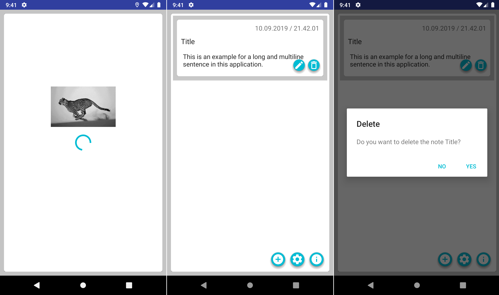
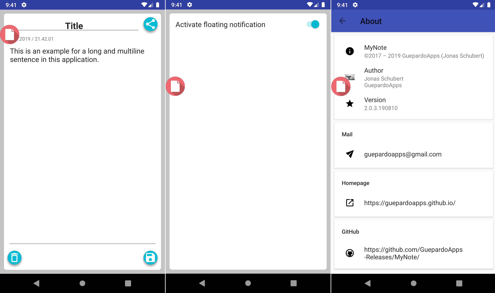

# MyNote - master branch

Simple android application with material design to create notes and saving them to a database.
Further feature is a floating bubble. So you can access your notes in a fast and easy way :+1:

## Screenshots

___________________________________

___________________________________

## License

MyNote is distributed under the MIT license. [See LICENSE](LICENSE.md) for details.